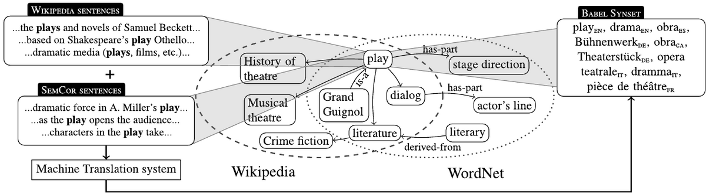

[//]: # (2.2 BABELNET)

[//]: # ()
[//]: # ()
[//]: # ()
[//]: # (Để khắc phục những hạn chế cố hữu của các tài nguyên từ vựng truyền thống, BabelNet &#40;Navigli & Ponzetto, 2012&#41; đã được phát triển như một mạng ngữ nghĩa đa ngôn ngữ và từ điển bách khoa. Đây là một trong những đồ thị tri thức đa ngôn ngữ lớn nhất hiện nay, được xây dựng thông qua một quy trình tích hợp tự động, kết hợp giữa WordNet và Wikipedia. Đơn vị khái niệm cốt lõi của nó là "Babel synset", đại diện cho một ý nghĩa duy nhất và nhóm các từ, cụm từ đồng nghĩa từ hàng trăm ngôn ngữ lại với nhau.)

[//]: # (Những lợi thế chính của BabelNet, và cũng là lý do chúng tôi chọn nó làm nền tảng tri thức có cấu trúc cho nghiên cứu này, bao gồm:)

[//]: # (![img_1.png]&#40;img_1.png&#41;)

[//]: # (- Tính đa ngôn ngữ: BabelNet phá vỡ rào cản ngôn ngữ ở cấp độ ngữ nghĩa, cho phép các hệ thống hiểu rằng 'Hà Nội' trong tiếng Việt và 'Hanoi' trong tiếng Anh cùng chỉ đến một thực thể.)

[//]: # ()
[//]: # (- Độ phủ rộng và mang tính Bách khoa: Việc tích hợp Wikipedia giúp BabelNet )

[//]: # (bao gồm cả các khái niệm từ vựng và một lượng lớn các thực thể được đặt tên )

[//]: # (- Cấu trúc quan hệ phong phú: BabelNet kế thừa các quan hệ phân cấp từ WordNet và bổ sung thêm các quan hệ liên kết được trích xuất từ cấu trúc của Wikipedia.)

[//]: # ()
[//]: # (Do những ưu điểm này, BabelNet cung cấp một bộ khung vững chắc để tính toán độ tương đồng dựa trên cấu trúc.)

# 🌐 2.2 BABELNET

## Giới thiệu

**BabelNet** (Navigli & Ponzetto, 2012) được phát triển nhằm khắc phục những hạn chế cố hữu của các tài nguyên từ vựng truyền thống. Đây là một **mạng ngữ nghĩa đa ngôn ngữ** và **từ điển bách khoa** lớn, được xem là một trong những **đồ thị tri thức đa ngôn ngữ** lớn nhất hiện nay.  

BabelNet được xây dựng thông qua một **quy trình tích hợp tự động**, kết hợp giữa **WordNet** và **Wikipedia** để tạo nên một mạng lưới ngữ nghĩa toàn cầu.  

Đơn vị khái niệm cốt lõi trong BabelNet là **Babel Synset**, đại diện cho **một ý nghĩa duy nhất** và nhóm các **từ/cụm từ đồng nghĩa** trong hàng trăm ngôn ngữ khác nhau.

---

## 💡 Lý do lựa chọn BabelNet

Những ưu điểm nổi bật của BabelNet — cũng là lý do chúng tôi chọn nó làm nền tảng tri thức có cấu trúc cho nghiên cứu này — bao gồm:

### 🌍 Tính đa ngôn ngữ
BabelNet phá vỡ rào cản ngôn ngữ ở cấp độ ngữ nghĩa, cho phép các hệ thống hiểu rằng:
> “Hà Nội” (tiếng Việt) và “Hanoi” (tiếng Anh) cùng chỉ đến **một thực thể duy nhất**.

---

### 📚 Độ phủ rộng và tính bách khoa
Nhờ tích hợp **Wikipedia**, BabelNet bao gồm không chỉ các **khái niệm từ vựng** mà còn **một lượng lớn các thực thể được đặt tên** — ví dụ như địa danh, nhân vật, tổ chức, và sự kiện.

---

### 🔗 Cấu trúc quan hệ phong phú
BabelNet kế thừa các **quan hệ phân cấp (hypernym–hyponym)** từ **WordNet** và đồng thời **bổ sung** các **quan hệ liên kết ngữ nghĩa** được trích xuất từ **Wikipedia**.  
Nhờ vậy, nó cung cấp một mạng lưới kết nối dày đặc, hỗ trợ mạnh mẽ cho các bài toán **tính toán độ tương đồng ngữ nghĩa** và **hiểu ngữ nghĩa tự động**.

---

## 🧠 Kết luận

Với những ưu điểm nổi bật trên, **BabelNet** cung cấp một **bộ khung tri thức vững chắc** cho việc:
- Tính toán độ tương đồng dựa trên cấu trúc.  
- Xây dựng các hệ thống **hiểu ngữ nghĩa đa ngôn ngữ**.  
- Phát triển các ứng dụng **xử lý ngôn ngữ tự nhiên (NLP)** và **AI ngữ nghĩa (Semantic AI)** hiện đại.

---

📖 **Tài liệu tham khảo:**
- Navigli, R., & Ponzetto, S. P. (2012). *BabelNet: The automatic construction, evaluation and application of a wide-coverage multilingual semantic network*. Artificial Intelligence, 193, 217–250.
